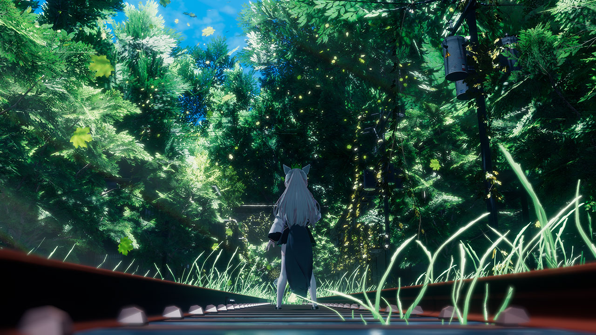

<div align="right">
  
</div>


<a href="https://krz-tech.net">
    
</a>



## Profile
```
- 🇯🇵 From Fukuoka.
- 🔰 I'm currently learning.
- 🖥️ A Infrastructure & Backend developer.
```

## Hobby
```
- 📷️ Photography
- 🎮️ Gaming
- 📱 Gadgets
```
<br>

## Skills
<div align="center">
	<code></code>
	<code></code>
	<code></code>
	<br>
	<code></code>
	<code></code>
	<code></code>
</div>

<br>

# | Stats

[](https://github.com/ashutosh00710/github-readme-activity-graph)

# | Activity
- Progateハッカソン powered by AWS 🏆️優秀賞＆AWS賞 (2025-07) [作品](https://topaz.dev/projects/ff454ddba004e991b867)
- ハックツハッカソン 〜イクチオカップ〜 🏆️優秀賞 (2025-09) [作品](https://topaz.dev/projects/8b2807a4a9c0881464b9)
- ハックツハッカソン 〜プテラカップ〜 特別賞 (2025-12) [作品](https://topaz.dev/projects/a638a35dba0e7df4048b)
- ハックツハッカソン 〜Nulabカップ〜 🏆最優秀賞 (2026-02) [作品](https://topaz.dev/projects/61e4cdc624f69aa00908)
- ハックツハッカソン 〜メガロカップ〜 🏆️優秀賞 (2026-03) [作品](https://topaz.dev/projects/afb5ff1dbfb7d031e984)


# | SNS
- [Twitter](https://twitter.com/kurazu_vrc)
- [Zenn](https://zenn.dev/krz_tech)
